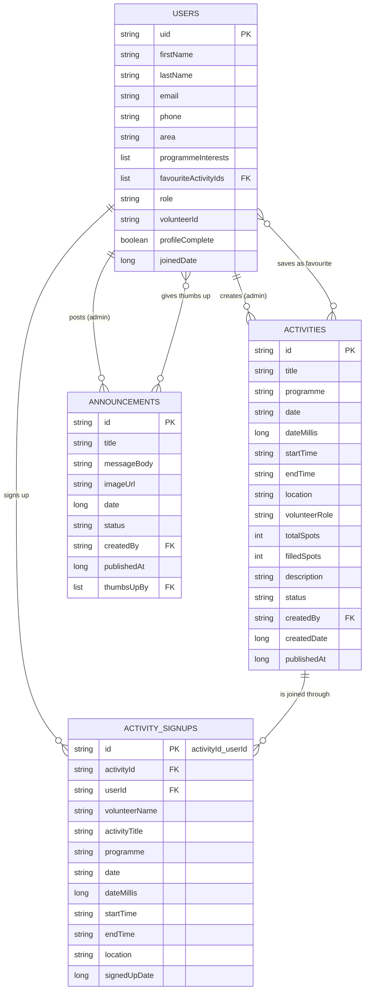

# Philisa Volunteers

**Android Application – Project README**

Developed by **Team KANTU** for **Philisa Abafazi Bethu**

---

## Table of Contents

1. [Introduction](#1-introduction)
2. [About Philisa Abafazi Bethu](#2-about-philisa-abafazi-bethu)
3. [Background and Requirements Gathering](#3-background-and-requirements-gathering)
4. [Functional Requirements](#4-functional-requirements)
5. [Non-Functional Requirements](#5-non-functional-requirements)
6. [User Roles and Permissions](#6-user-roles-and-permissions)
7. [Features](#7-features)
8. [Technology Stack](#8-technology-stack)
9. [System Architecture](#9-system-architecture)
10. [Integrations and the API Layer](#10-integrations-and-the-api-layer)
11. [Design Patterns](#11-design-patterns)
12. [Data Model](#12-data-model)
13. [Security and Privacy](#13-security-and-privacy)
14. [Getting Started](#14-getting-started)
15. [Project Structure](#15-project-structure)
16. [DevOps and Development Workflow](#16-devops-and-development-workflow)
17. [Running Costs](#17-running-costs)
18. [Project Status and Future Work](#18-project-status-and-future-work)
19. [The Team](#19-the-team)

---

## 1. Introduction

Philisa Volunteers is an Android application that brings the volunteer experience at Philisa Abafazi Bethu (PAB) into one place.

Anyone who wants to get involved can create an account, fill in a short two-step profile, and start volunteering straight away. There is no waiting for approval.

**Volunteers can:**

- Browse opportunities and join or leave activities
- Keep track of their schedule and hours
- Stay up to date with announcements from PAB

**PAB staff can:**

- Manage volunteers
- Publish activities
- Post announcements

**The app also:**

- Is available in **English, isiXhosa and Afrikaans**
- Supports **light and dark mode**
- Adapts to **phones and tablets**, in portrait and landscape
- Keeps working when the phone loses signal

This README covers the background to the project, its requirements, how the app is built, and how to get it running on your own machine.

---

## 2. About Philisa Abafazi Bethu

Philisa Abafazi Bethu, which means *"Heal Our Women"* in isiXhosa, is a non-profit organisation founded in 2008.

- **Started in:** Lavender Hill, Cape Town
- **Now based in:** Steenberg, Cape Town
- **Supports:** women, children and families

The app lists ten PAB programmes that volunteers can support:

| # | Programme | # | Programme |
|---|-----------|---|-----------|
| 1 | Afterschool Programmes | 6 | Senior Programme |
| 2 | Youth Programme | 7 | Community Feeding |
| 3 | Women Empowerment | 8 | Men's Café |
| 4 | Baby Saver | 9 | Search and Rescue Team |
| 5 | Emergency Safe Houses | 10 | Social Work Services |

Volunteers are a big part of what makes this work possible, and this app was built with them in mind.

---

## 3. Background and Requirements Gathering

### 3.1 How the Requirements Were Gathered

The requirements came from working directly with PAB over several meetings and site visits, rather than from what we assumed would be useful.

| Date | Engagement | Outcome |
|------|------------|---------|
| 19 May 2026 | Site visit and online meeting with the director | Saw PAB's work first-hand |
| 27 July 2026 | In-person meeting with the director | PAB shared its wish list of digital solutions |
| 4 August 2026 | Presented three project ideas | PAB chose the idea that included this app |

**During the site visit, the team saw:**

- The safe houses
- The Baby Saver
- The children's programmes
- The community feeding garden

**We also researched existing volunteer apps:**

- Volunteero
- Thina
- Bloomerang Volunteer

These were used as a reference only. The final requirements are based on PAB's own needs.

### 3.2 The Problem

**Problem 1: Applying is inconvenient**

- *Currently:* volunteer applications are PDF forms sent by email.
- *Impact:* this can discourage people from getting involved.

**Problem 2: No central place for information**

- *Currently:* there is nowhere to see upcoming programmes, events and opportunities.
- *Impact:* regular volunteers find it hard to stay informed.

**Problem 3: No tool for staff**

- *Currently:* staff can't track volunteers, share opportunities and communicate in one place.
- *Impact:* managing volunteers takes more time and effort than it should.

Philisa Volunteers solves these problems by giving volunteers and staff one app for the whole volunteer journey.

---

## 4. Functional Requirements

| ID | Requirement | Role | Status |
|----|-------------|------|:------:|
| PV-FR01 | Anyone must be able to create an account with email and password, or with their Google account. | Visitor | ✔ |
| PV-FR02 | New users must complete a two-step profile, then become a volunteer immediately. | Visitor | ✔ |
| PV-FR03 | Users must be able to sign in securely and reset a forgotten password by email. | All | ✔ |
| PV-FR04 | Volunteers must be able to browse published opportunities and open one to see its full details. | Volunteer | ✔ |
| PV-FR05 | Volunteers must be able to join an activity, as long as spots are still available. | Volunteer | ✔ |
| PV-FR06 | Volunteers must be able to leave an activity they joined, which gives the spot back. | Volunteer | ✔ |
| PV-FR07 | Volunteers must be able to see their activities as Upcoming and Completed, and view them on a schedule. | Volunteer | ✔ |
| PV-FR08 | Volunteers must be able to save opportunities as favourites. | Volunteer | ✔ |
| PV-FR09 | Volunteers must be able to read announcements from PAB and give them a thumbs up. | Volunteer | ✔ |
| PV-FR10 | Volunteers must receive notifications about new activities and announcements. | Volunteer | ✔ |
| PV-FR11 | Volunteers must be able to view and edit their profile, and delete their account. | Volunteer | ✔ |
| PV-FR12 | Administrators must be taken to a separate admin area when they sign in. | Administrator | ✔ |
| PV-FR13 | Administrators must be able to view all volunteers and their details. | Administrator | ✔ |
| PV-FR14 | Administrators must be able to create, edit, publish, unpublish and delete activities. | Administrator | ✔ |
| PV-FR15 | Administrators must be able to see who has signed up for each activity. | Administrator | ✔ |
| PV-FR16 | Administrators must be able to create, publish and delete announcements, with an optional picture. | Administrator | ✔ |
| PV-FR17 | Administrators must be notified when an activity becomes fully booked. | Administrator | ✔ |

---

## 5. Non-Functional Requirements

### 5.1 Languages and Themes

*The app should be usable by people with different levels of digital experience and language preferences.*

- Available in English, isiXhosa and Afrikaans
- Clear labels and simple bottom navigation
- Light and dark themes

### 5.2 Responsiveness and Screen Sizes

*The app should adapt smoothly to phones and tablets, in portrait and landscape.*

- **Tablet layouts:** dedicated layouts make use of the extra space on larger screens.
- **Landscape:** the Welcome screen has its own landscape layout.
- **Two-column lists:** lists switch to two columns on a tablet.
- **One set of layouts:** this is done with Android's alternate resource folders, not duplicated layouts. One set of layouts serves every screen size, so a change only has to be made once.

### 5.3 Accessibility Standards

*The app should meet Android's accessibility guidelines.*

- **Touch targets:** every button and tappable control is at least **48dp**, Android's recommended minimum.
- **Text scaling:** all text scales with the phone's font size setting, and the app still works at the largest size.
- **Languages and themes:** English, isiXhosa and Afrikaans, with light and dark mode (see 5.1).

### 5.4 Usability

*Users should be able to use the app without training.*

- A short two-step sign-up
- Friendly messages on empty screens, for example *"You haven't joined an activity yet"*
- A confirmation step before leaving an activity or deleting an account

### 5.5 Reliability

*The app should keep working when the connection drops, without losing information.*

- Firestore's offline cache lets volunteers see their data without signal
- Joining an activity uses a database transaction, so two people can never take the last spot

### 5.6 Performance

*Screens and key actions should respond quickly.*

- Images are loaded and cached with Glide
- Lists use RecyclerView
- Pull-to-refresh on list screens

### 5.7 Availability

*The system should be available when volunteers need it.*

- Firebase is a managed Google Cloud service
- Target of **99.9% uptime**

### 5.8 Scalability

*The app should grow with PAB without needing to be rebuilt.*

- A layered, modular code structure
- A database that scales automatically

### 5.9 Security

*Personal information must be protected, and access restricted by role.*

- Firebase Security Rules on every collection
- **25 security rules tests** run automatically against the Firestore emulator on every push

---

## 6. User Roles and Permissions

### 6.1 User Roles

There is no approval step. As soon as a new user completes their profile, they become a volunteer.

| Role | Who | How the Role Is Given |
|------|-----|-----------------------|
| Visitor | Opened the app, no account yet | – |
| Volunteer | Created an account and completed their profile | Automatically, on sign-up |
| Administrator | Authorised PAB staff member | Set by hand in the Firebase console |

> **Note:** Every new account starts as a volunteer. To make someone an admin, change their `role` to `admin` in the Firebase console. This can't be done from inside the app.

### 6.2 Permission Matrix

These permissions are enforced by the Firebase Security Rules, not just by the app's screens.

| Action | Visitor | Volunteer | Administrator |
|--------|:-------:|:---------:|:-------------:|
| View the welcome and About PAB screens | ✔ | ✔ | ✔ |
| Create an account | ✔ | – | – |
| Read and edit own profile | – | ✔ | ✔ |
| Change own role, volunteer ID, email or join date | – | ✘ | ✔ (via console) |
| Read other volunteers' profiles | – | ✘ | ✔ |
| Browse activities and announcements | – | ✔ | ✔ |
| Join or leave an activity | – | ✔ | – |
| Give an announcement a thumbs up | – | ✔ | ✔ |
| See who signed up for an activity | – | Own sign-ups only | ✔ |
| Create, edit, publish or delete activities | – | ✘ | ✔ |
| Create, publish or delete announcements | – | ✘ | ✔ |
| Delete own account | – | ✔ | ✔ |
| Delete another user's account | – | ✘ | ✘ |

---

## 7. Features

### 7.1 Getting Started (Visitors)

The first time someone opens the app, they go through these screens:

1. **Splash:** checks whether the user is already signed in.
2. **Welcome:** introduces PAB, with two options:
   - Continue with Google
   - Sign in with email
3. **About PAB:** PAB's work, programmes, volunteer stories and contact details.
4. **Email sign-in / sign-up:**
   - Create an account or sign in
   - Forgot password option
   - Passwords need at least 8 characters, including a symbol
5. **Profile setup, step 1 of 2:**
   - First and last name
   - South African cellphone number
   - Area or township
6. **Profile setup, step 2 of 2:** choose the programmes they're interested in.

### 7.2 Volunteers

Volunteers use a bottom navigation bar with five tabs.

**Home**

- A greeting based on the time of day
- Today's activities
- Stats: today, completed and hours
- What's coming up

**Activities**

- Browse **All** opportunities or just **Favourites**
- Open an activity to see its details and spots remaining
- **Join** or **Leave** an activity
- My Activities, split into **Upcoming** and **Completed**

**Schedule**

- Upcoming and completed activities, in date order

**Community**

- Announcements from PAB, with pictures
- Give an announcement a thumbs up

**Profile**

- Personal details and volunteer ID
- Stats
- Edit profile or sign out

### 7.3 Administrators

Administrators have their own bottom navigation bar with four tabs.

**Overview**

- Total volunteers, total sign-ups and published activities
- Recent volunteers
- Quick actions: create an activity or post an announcement

**Volunteers**

- A list of all registered volunteers
- A details screen for each volunteer

**Activities**

- Create, edit and delete activities
- Publish or unpublish activities
- See how many spots are filled and who has signed up

**Posts**

- Create, edit and delete announcements
- Publish or unpublish announcements
- Add an optional picture
- See the thumbs-up count

### 7.4 Settings

Available to everyone who is signed in:

| Setting | Options |
|---------|---------|
| Theme | Follow the phone, Light, Dark |
| Language | English, isiXhosa, Afrikaans |
| Notifications | New activities, Announcements, Activity full (admins) |
| Account | Delete my account |

- The chosen language is also used for notifications and password-reset emails.
- Deleting an account removes the profile and gives the volunteer's places back.

### 7.5 Notifications

- A background worker checks Firestore for anything new.
- It runs roughly every 15 minutes while the phone is connected.
- New items are shown in the matching notification channel.

| Channel | Who Receives It | When |
|---------|-----------------|------|
| New activities | Volunteers | A new activity is published |
| Announcements | Volunteers | PAB posts a new announcement |
| Full activities | Administrators | Every spot on an activity has been taken |

---

## 8. Technology Stack

### 8.1 Technologies

| Area | Technology |
|------|------------|
| Platform | Native Android (minimum SDK 26 / Android 8.0; target and compile SDK 34) |
| Language | Kotlin 2.0.20 (JVM target 17) |
| Build system | Gradle (Kotlin DSL), Android Gradle Plugin 8.5.2, version catalog |
| User interface | XML layouts, Material Components, ConstraintLayout, RecyclerView, SwipeRefreshLayout, View Binding |
| Navigation | Jetpack Navigation Component (separate graphs for auth, volunteer and admin) |
| Architecture components | ViewModel, LiveData, Kotlin Coroutines |
| Authentication | Firebase Authentication (email/password and Google Sign-In) |
| Database | Cloud Firestore with persistent offline cache |
| Image hosting | Cloudinary (announcement pictures) |
| Image loading | Glide |
| Background work | WorkManager |
| Testing | JUnit unit tests; Firestore Security Rules tests with the Firebase emulator (Node.js) |
| CI | GitHub Actions |

### 8.2 Why We Chose Firebase

1. **Offline support**
   - Many volunteers work in areas with unreliable signal, such as Lavender Hill, Steenberg and Khayelitsha.
   - Firestore's cache means the app still shows data offline.
2. **Built-in security**
   - Security Rules control who can read and change each record, directly in the database.
3. **Simple sign-in**
   - Handles email/password, Google Sign-In and password-reset emails.
4. **Low running costs**
   - The free tier allows 50,000 reads, 20,000 writes and 20,000 deletes per day.
   - This comfortably covers PAB's expected usage.

### 8.3 Alternatives Considered

**Azure SQL / PostgreSQL**

- *Strengths:* strong data integrity and structured schemas
- *Why not:* fixed hosting costs of around R280 to R450 a month
- *Why not:* no built-in offline syncing for mobile
- *Why not:* more database administration

**MongoDB Atlas**

- *Strengths:* flexible documents and powerful queries
- *Why not:* higher entry-tier costs
- *Why not:* more complex mobile syncing than Firebase

---

## 9. System Architecture

### 9.1 Layered Architecture

The app is organised into layers, so each part has one job and changes in one place don't ripple through the whole app.

```
┌──────────────────────────────────────────────────────────────┐
│  UI LAYER                                          ui/        │
│  Activities & Fragments (auth, volunteer, admin, profile,    │
│  settings) · RecyclerView Adapters · View Binding            │
├──────────────────────────────────────────────────────────────┤
│  VIEWMODEL LAYER                                             │
│  AuthViewModel · ProfileSetupViewModel · VolunteerViewModel  │
│  · AdminViewModel                                            │
├──────────────────────────────────────────────────────────────┤
│  DATA LAYER                                        data/      │
│  Repositories: Auth · Account · User · Activity ·            │
│  Signup · Announcement                                       │
│  Models: User · Activity · ActivitySignup · Announcement     │
├──────────────────────────────────────────────────────────────┤
│  SERVICES                                                    │
│  FirebaseAuthManager · FirestoreManager · ImageUploader      │
│  (Cloudinary) · UpdatesWorker (WorkManager)                  │
└──────────────────────────────────────────────────────────────┘
```

**UI layer** (`ui/`)

- Screens, lists and user input
- Split into `auth`, `volunteer`, `admin`, `profile` and `settings`

**ViewModel layer**

- Holds each screen's state
- Calls the repositories
- Keeps data when the phone is rotated

**Data layer** (`data/repository`, `data/model`)

- Repositories are the only classes that talk to Firebase
- Models match the Firestore documents

**Services** (`data/firebase`, `data/remote`, `notifications/`)

- Firebase set-up
- Picture uploads
- Background notifications

**Utilities** (`utils/`)

- Language and theme
- Dates and phone number validation
- Error messages and network checks

### 9.2 Navigation

| Graph | Screens |
|-------|---------|
| `AuthNavGraph` | Splash, Welcome, About PAB, Sign-in, Profile setup |
| `VolunteerNavGraph` | Home, Activities, Schedule, Community, Profile |
| `AdminNavGraph` | Overview, Volunteers, Activities, Posts |
| `AppNavGraph` | Chooses which of the graphs above to show |

`AppNavGraph` decides based on:

- Whether the user is signed in
- Whether they have finished their profile
- Whether they are an admin

### 9.3 How Data Flows Through the App

```
        ┌──────────────────────────────┐
        │   Philisa Volunteers (App)   │
        │   UI ─► ViewModel ─► Repo    │
        └───┬──────────┬───────────┬───┘
            │          │           │
   sign-in  │  reads & │  picture  │
            ▼  writes  ▼  uploads  ▼
  ┌──────────────┐ ┌──────────────┐ ┌──────────────┐
  │   Firebase   │ │    Cloud     │ │  Cloudinary  │
  │     Auth     │ │  Firestore   │ │              │
  └──────────────┘ └──────▲───────┘ └──────────────┘
                          │ checks for new items
                          │ (about every 15 min)
                 ┌────────┴────────┐
                 │  UpdatesWorker  │──► Local notifications
                 │  (WorkManager)  │
                 └─────────────────┘
```

---

## 10. Integrations and the API Layer

The app connects to three external services. All of them are reached through the data layer, so no screen ever talks to a network service directly.

### 10.1 External Services

| Service | What It Does | How We Connect |
|---------|--------------|----------------|
| Cloudinary | Hosts announcement pictures | REST API over HTTPS, with our own client |
| Firebase Authentication | Sign-in, Google Sign-In, password reset | Official Android SDK |
| Cloud Firestore | Stores every record, plus the offline cache | Official Android SDK |

**Why we use the SDKs for Firebase:**

- They give us an offline cache, automatic retries and token refresh without extra code.
- Raw REST calls would have meant more code and worse behaviour on a poor connection.
- This matters for volunteers in areas with unreliable signal.

### 10.2 The Repository Layer (Internal API)

- Six repositories expose **32 operations**. Together, these are the app's internal API.
- Screens and ViewModels only ever call these operations.
- All operations are `suspend` functions, so nothing freezes the screen.

**Every operation follows the same rule:**

| Type of Operation | Returns | Why |
|-------------------|---------|-----|
| Writes (anything that changes data) | `Result<T>` | The caller has to handle a possible failure |
| Reads | The value, or `null` if nothing is there | Simple to use |

```kotlin
// Writes return Result, so failure must be handled
suspend fun join(activity: Activity, user: User): Result<Unit>
suspend fun createActivity(activity: Activity, createdBy: String): Result<String>

// Reads return the value, or null
suspend fun getUser(uid: String): User?
suspend fun getPublishedActivities(): List<Activity>
```

**Why this matters:** announcement pictures were first hosted with a different provider, which started refusing our uploads. Because screens call an uploader, not a specific provider, switching to Cloudinary only changed **one file**. No screen or ViewModel had to change.

### 10.3 The Cloudinary REST Client

Announcement pictures are uploaded through Cloudinary's REST API. We wrote the client ourselves in `data/remote/ImageUploader.kt`, instead of using a library, so every part of the request is clear.

| Part | Detail |
|------|--------|
| Endpoint | `POST https://api.cloudinary.com/v1_1/{cloud_name}/image/upload` |
| Content type | `application/x-www-form-urlencoded` |
| Request body | The picture as a base64 data URI, plus the `upload_preset` |
| Success | HTTP 200–299 |
| Response used | `secure_url`, the HTTPS link to the stored picture |
| Timeouts | 30 seconds to connect, 30 seconds to read |

```kotlin
val code = connection.responseCode
val stream = if (code in 200..299) connection.inputStream else connection.errorStream
val response = stream?.bufferedReader()?.use { it.readText() }.orEmpty()

if (code !in 200..299) throw failureFor(response, code)
return JSONObject(response).getString("secure_url")
```

- The status code decides whether to read the success or the error response.
- Upload preset problems get their own message. Other errors keep Cloudinary's own wording, so the reason isn't lost.
- Firestore only stores the returned link. The picture itself never goes into the database.

**Why the upload is unsigned:**

- A signed upload needs Cloudinary's secret key.
- Anything inside an APK can be extracted by whoever downloads it.
- So we use an unsigned upload preset instead. No secret ships with the app, and what uploads are allowed to do is controlled on Cloudinary's side.

### 10.4 Error Handling

Each service reports errors differently. All of them are translated in one place, `utils/ErrorMessages.kt`, into a clear message the user can act on.

| Error | What the User Sees |
|-------|--------------------|
| Firestore `UNAVAILABLE` or `DEADLINE_EXCEEDED` | A "no connection" message |
| Firestore `PERMISSION_DENIED` | A clear permission message |
| Wrong password | "Incorrect email or password" |
| Email already registered | "That email already has an account" |
| Failed transaction, e.g. activity full | The real reason, found inside the wrapped error |

**Other details:**

- **Offline writes:** the app checks the connection before saving. Firestore quietly queues writes while offline, so without this check a save would seem to hang forever.
- **Correct language:** messages are stored as string resources and only turned into words by the screen that shows them, so errors appear in the language the user chose.
- **Tested:** 11 unit tests cover this mapping, including one that checks every error leads to a real message.

---

## 11. Design Patterns

### 11.1 Repository

- **Used in:** `AuthRepository`, `UserRepository`, `ActivityRepository`, `SignupRepository`, `AnnouncementRepository`, `AccountRepository`
- **Why:** keeps all Firebase code in one place. Screens never call Firestore directly, so the database could change without rewriting the UI.

### 11.2 MVVM (Model–View–ViewModel)

- **Used in:** `VolunteerViewModel`, `AdminViewModel`, `AuthViewModel`, `ProfileSetupViewModel`
- **Why:** separates what the screen shows from how the data is loaded, and keeps state when the phone is rotated.

### 11.3 Observer

- **Used in:** LiveData in the ViewModels
- **Why:** screens update automatically when the data they are watching changes.

### 11.4 Singleton

- **Used in:** `FirestoreManager`, `FirebaseAuthManager`, `AppLanguage`, `ThemePreference`
- **Why:** one shared database connection and one place for app settings.

### 11.5 Adapter

- **Used in:** `ActivityAdapter`, `AnnouncementAdapter`, `VolunteerAdapter`, `SignupAdapter` and others
- **Why:** turns lists of data into rows on screen.

---

## 12. Data Model

### 12.1 Entity Relationship Diagram

The diagram below shows the four Firestore collections, their primary keys (PK), foreign keys (FK) and how they relate, using crow's foot notation. GitHub draws it automatically.



| Relationship | Cardinality | Meaning |
|--------------|-------------|---------|
| Users → Activity Signups | One to many | A volunteer can join many activities |
| Activities → Activity Signups | One to many | An activity can have many volunteers, up to `totalSpots` |
| Users → Activities | One to many | An admin creates many activities |
| Users → Announcements | One to many | An admin posts many announcements |
| Users ↔ Announcements | Many to many | Volunteers give thumbs up, stored in `thumbsUpBy` |
| Users ↔ Activities | Many to many | Volunteers save favourites, stored in `favouriteActivityIds` |

### 12.2 Collections and Fields

| Collection | What It Stores |
|------------|----------------|
| `users` | Each person's profile |
| `activities` | Volunteer opportunities created by admins |
| `activitySignups` | A volunteer's place on an activity |
| `announcements` | Posts from PAB to volunteers |

**`users` fields**

| Field | Type | Description |
|-------|------|-------------|
| `firstName`, `lastName` | String | Volunteer's name |
| `email`, `phone` | String | Contact details |
| `area` | String | Area or township |
| `programmeInterests` | List | Programmes they chose during sign-up |
| `favouriteActivityIds` | List | Saved opportunities |
| `role` | String | `volunteer` or `admin` |
| `volunteerId` | String | Volunteer ID shown on their profile |
| `profileComplete` | Boolean | Whether sign-up is finished |
| `joinedDate` | Number | When they joined |

**`activities` fields**

| Field | Type | Description |
|-------|------|-------------|
| `title`, `description` | String | What the activity is |
| `programme` | String | Which PAB programme it belongs to |
| `date`, `dateMillis` | String / Number | Activity date |
| `startTime`, `endTime` | String | Activity times |
| `location` | String | Where it takes place |
| `volunteerRole` | String | What volunteers will do |
| `totalSpots`, `filledSpots` | Number | Capacity and spots taken |
| `status` | String | `draft` or `published` |
| `createdBy`, `createdDate`, `publishedAt` | String / Number | Who created it and when |

**`activitySignups` fields**

| Field | Type | Description |
|-------|------|-------------|
| `activityId`, `userId` | String | Links the volunteer to the activity |
| `volunteerName` | String | Shown to admins |
| `activityTitle`, `programme`, `location` | String | Copied from the activity |
| `date`, `dateMillis`, `startTime`, `endTime` | String / Number | Copied from the activity |
| `signedUpDate` | Number | When they joined |

**`announcements` fields**

| Field | Type | Description |
|-------|------|-------------|
| `title`, `messageBody` | String | The announcement |
| `imageUrl` | String | Optional picture (empty if none) |
| `date` | Number | Announcement date |
| `status` | String | `draft` or `published` |
| `createdBy`, `publishedAt` | String / Number | Who posted it and when |
| `thumbsUpBy` | List | Volunteers who gave it a thumbs up |

### 12.3 Design Decisions

**1. Sign-up IDs are `activityId_userId`**

- One fixed ID per person per activity.
- The same spot can never be taken twice.

**2. Joining uses a Firestore transaction**

- The activity is re-read from the server and the spot is taken in one step.
- Two people can't take the last spot at the same time.

**3. Sign-ups copy the activity's details**

- The title, date and location are saved with the sign-up.
- Volunteers keep their history and hours, even if the activity is later deleted.

**4. Leaving an activity deletes the sign-up**

- There's no approval status, so there's nothing to keep.
- The spot goes straight back to the group.

**5. Some values are calculated, not stored**

- `fullName`, `isAdmin` and `spotsRemaining` are worked out in the app.
- They are never saved to Firestore, so they can't get out of sync.

### 12.4 Status Values

| Field | Possible Values |
|-------|-----------------|
| `role` | `volunteer`, `admin` |
| Activity `status` | `draft`, `published` |
| Announcement `status` | `draft`, `published` |

---

## 13. Security and Privacy

### 13.1 Firebase Security Rules

All access is controlled by `firestore.rules`.

**`users`**

- Users can read their own record. Admins can read everyone's.
- A new record must start with the role `volunteer`.
- Users can edit their own profile, but not their `role`, `volunteerId`, `email` or `joinedDate`.
- Only the user can delete their own account.

**`activities`**

- Any signed-in user can read.
- Only admins can create, edit or delete.
- Volunteers can only change the spot counter:
  - by one at a time
  - together with their own sign-up
  - never below 0 or above the total

**`announcements`**

- Any signed-in user can read.
- Only admins can create, edit or delete.
- Volunteers can only add or remove their own thumbs up.

**`activitySignups`**

- Volunteers see their own places.
- Admins see who signed up for what.

### 13.2 Other Measures

- **Rules testing:** 25 automated tests run against the Firebase emulator on every push. They prove, for example, that a volunteer can't make themselves an admin or edit anyone else's profile.
- **Passwords:** at least 8 characters, including a symbol.
- **Account deletion:**
  - Users can delete their own account and data at any time, in line with POPIA.
  - Firebase asks them to sign in again first.
- **Secrets:**
  - Cloudinary keys are kept in `local.properties`.
  - Release signing details are kept in `keystore.properties`.
  - Neither file is committed to Git.
- **Offline data:** the cache only holds data the user is allowed to read.

---

## 14. Getting Started

### 14.1 What You Will Need

- Android Studio (latest stable version)
- JDK 17
- An emulator or Android device running Android 8.0 or later
- Git
- Node.js 20 (only needed to run the security rules tests or the seed script)

### 14.2 Setting Up the Project

**Step 1: Clone the repository**

Switch to the `develop` branch, which holds the latest working code.

```bash
git clone https://github.com/Kwethukubonga/PAB_Volunteers.git
cd PAB_Volunteers
git checkout develop
```

**Step 2: Open the project**

Open the `PAB_Volunteers` folder in Android Studio.

**Step 3: Add the Cloudinary details**

Copy `local.properties.example` to `local.properties`, then add the Cloudinary details (ask a team member for them).

```properties
cloudinary.cloud.name=YOUR_CLOUD_NAME
cloudinary.upload.preset=YOUR_UPLOAD_PRESET
```

The app still runs without these, but picture uploads on announcements won't work.

**Step 4: Run the app**

Wait for Gradle to sync, then choose a device and click **Run**.

> **Note:** The Firebase configuration (`google-services.json`) and a shared debug keystore are already included, so Google Sign-In works on every team member's debug build.

### 14.3 Creating an Admin Account

1. Sign up in the app as normal.
2. In the Firebase console, go to **Firestore > users**, find your record, and change `role` from `volunteer` to `admin`.
3. Sign out and sign back in to open the admin area.

### 14.4 Adding Sample Data

The seed script adds one sample activity and one announcement for each PAB programme. You'll need a Firebase service account key, which must **never** be committed.

```bash
cd tools/seed
npm install
node seed.js --dry-run                 # shows what would be added
node seed.js --key <path to key file>  # adds the samples
node seed.js --key <path to key file> --remove   # removes them again
```

### 14.5 Useful Commands

| Task | Windows | macOS / Linux |
|------|---------|---------------|
| Build a debug APK | `gradlew.bat assembleDebug` | `./gradlew assembleDebug` |
| Run unit tests | `gradlew.bat testDebugUnitTest` | `./gradlew testDebugUnitTest` |
| Run lint | `gradlew.bat lintDebug` | `./gradlew lintDebug` |
| Run security rules tests | `cd firestore-tests && npm install && npm test` | same |

---

## 15. Project Structure

```
PAB_Volunteers/
├── .github/workflows/android.yml       # CI pipeline
├── app/
│   ├── build.gradle.kts                # App settings and dependencies
│   ├── google-services.json            # Firebase configuration
│   └── src/
│       ├── main/java/com/kantu/pab_volunteers/
│       │   ├── data/
│       │   │   ├── firebase/           # FirebaseAuthManager, FirestoreManager
│       │   │   ├── model/              # User, Activity, ActivitySignup, Announcement
│       │   │   ├── remote/             # ImageUploader (Cloudinary)
│       │   │   └── repository/         # Auth, Account, User, Activity, Signup, Announcement
│       │   ├── navigation/             # App, Auth, Volunteer and Admin nav graphs
│       │   ├── notifications/          # UpdatesWorker, channels, settings, permission prompt
│       │   ├── ui/
│       │   │   ├── auth/               # Splash, Welcome, About PAB, Email sign-in, Google sign-in
│       │   │   ├── profile/            # Two-step profile setup and programme list
│       │   │   ├── volunteer/          # Home, Activities, Schedule, Community, Profile
│       │   │   ├── admin/              # Overview, Volunteers, Activities, Announcements
│       │   │   └── settings/           # Theme, language, notifications, delete account
│       │   ├── utils/                  # Language, theme, dates, phone numbers, errors
│       │   └── PabApplication.kt
│       ├── main/res/                   # Layouts (incl. tablet and landscape), strings (en, xh, af), themes
│       └── test/                       # Unit tests
├── firestore-tests/                    # Security rules tests (Firebase emulator)
├── tools/seed/                         # Sample data script
├── keystore/debug.keystore             # Shared debug key (release keys are never committed)
├── firestore.rules                     # Firestore security rules
├── local.properties.example            # Template for Cloudinary settings
├── keystore.properties.example         # Template for release signing
└── settings.gradle.kts
```

---

## 16. DevOps and Development Workflow

### 16.1 Branching Strategy

| Branch | Purpose |
|--------|---------|
| `master` | The stable, release-ready version of the app. |
| `develop` | Where finished features are brought together and tested. |
| `feature/…` | One branch per feature, e.g. `feature/authentication` |

```
 feature/* ─► Pull Request ─► CI checks ─► Peer review ─► develop ─► master
```

### 16.2 Continuous Integration

GitHub Actions runs on every push and Pull Request to `master` and `develop`.

| Step | Job | What It Does |
|:----:|-----|--------------|
| 1 | Unit tests | Runs all 66 unit tests and saves a report |
| 1 | Lint | Checks the code for errors, including missing translations |
| 1 | Rules | Runs all 25 security rules tests |
| 2 | Build APK | Builds the app, once all three checks pass |

- Jobs in step 1 run at the same time.
- The built APK can be downloaded from GitHub for 30 days.
- A new push cancels any run still going for the same branch.
- Cloudinary details come from GitHub Secrets, so they never appear in the code.

### 16.3 Testing

The project has **91 automated tests**, and all of them run on every push.

| Type | Number of Tests | Runs On |
|------|:---------------:|---------|
| Unit tests | 66 | Every push (JUnit) |
| Security rules tests | 25 | Every push (Firebase emulator) |
| **Total** | **91** | |

**Unit tests cover:**

- Data models
- Utilities, including phone number validation
- Error handling (11 tests, see section 10.4)

**Security rules tests prove, for example, that:**

- A volunteer can't make themselves an admin
- A volunteer can't change another person's profile
- A volunteer can't change their own email, volunteer ID or join date
- A volunteer can only read their own record, while an admin can read everyone's

**Device testing**

- Android Studio emulator
- Physical Android devices

**User Acceptance Testing**

- PAB representatives will test the app before release.

### 16.4 Hosting and Distribution

The app will be shared through a simple download page on **Firebase Hosting**, so PAB can send volunteers a link to install it.

- **Download page:** *link to be added once live*
- **Status:** in progress

**Before publishing a build:**

1. **Create a release keystore.** Register its SHA-1 fingerprint in the Firebase console, or Google Sign-In won't work on the hosted build.
2. **Work around the `.apk` block.** Firebase Hosting's free plan blocks files ending in `.apk`. Serve the file under a different extension, with a `Content-Disposition` header, so it still downloads with the correct `.apk` filename.

---

## 17. Running Costs

| Item | Service | Estimated Cost |
|------|---------|----------------|
| App download page | Firebase Hosting | R0 on the free plan |
| Google Play (optional, later) | Google Play Console | US$25 once-off (approximately R460) |
| Authentication | Firebase Authentication | R0 within free limits |
| Database | Cloud Firestore | R0 within free limits |
| Picture hosting | Cloudinary | R0 on the free plan |
| Notifications | WorkManager (on the device) | R0 |

---

## 18. Project Status and Future Work

### 18.1 Current Status

| Area | Status |
|------|:------:|
| Sign-up, sign-in, Google Sign-In and password reset | ✔ Complete |
| Two-step profile setup with programme interests | ✔ Complete |
| Volunteer Home, Activities, Schedule, Community and Profile | ✔ Complete |
| Joining and leaving activities, favourites | ✔ Complete |
| Admin Overview, Volunteers, Activities and Posts | ✔ Complete |
| Notifications | ✔ Complete |
| English, isiXhosa and Afrikaans | ✔ Complete |
| Light and dark mode | ✔ Complete |
| Firestore Security Rules and rules tests | ✔ Complete |
| Tablet, landscape and accessibility support | ✔ Complete |
| 91 automated tests | ✔ Complete |
| GitHub Actions pipeline | ✔ Complete |
| Release build and hosted download page (Firebase Hosting) | ⏳ In progress |
| User Acceptance Testing with PAB | ☐ Planned |
| Google Play distribution | ☐ Planned |

### 18.2 Possible Future Improvements

- Instant push notifications through Firebase Cloud Messaging, instead of checking every 15 minutes.
- WhatsApp or SMS reminders for volunteers.
- Attendance tracking, so admins can confirm who attended an activity.

---

## 19. The Team

Philisa Volunteers is being developed by **Team KANTU**:

| Team Member |
|-------------|
| Kwethukubonga Kunene |
| Letlhogonolo Kgatshe |
| Nuha Grimwood |
| Unathi Mudzengi |
| Ash Kruger |

We would like to thank Philisa Abafazi Bethu for welcoming us into their space, sharing their time and helping shape this project around the real needs of their volunteers and community.

---

*Built for Philisa Abafazi Bethu – "Heal Our Women"*
