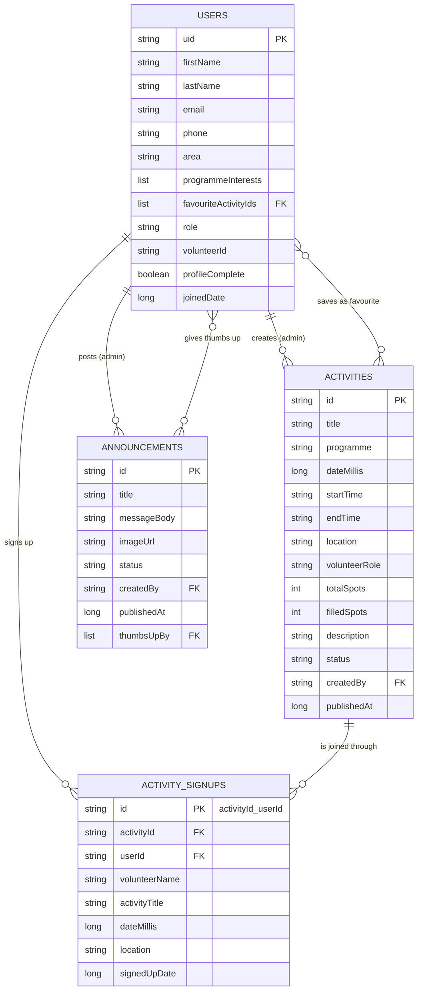

# Philisa Volunteers

Developed by **Team KANTU** for **Philisa Abafazi Bethu**

---

## Table of Contents

1. [Introduction](#1-introduction)
2. [Background](#2-background)
3. [Functional Requirements](#3-functional-requirements)
4. [Non-Functional Requirements](#4-non-functional-requirements)
5. [User Roles and Permissions](#5-user-roles-and-permissions)
6. [Features](#6-features)
7. [Technology Stack](#7-technology-stack)
8. [System Architecture](#8-system-architecture)
9. [Integrations and the API Layer](#9-integrations-and-the-api-layer)
10. [Data Model](#10-data-model)
11. [Security and Privacy](#11-security-and-privacy)
12. [Getting Started](#12-getting-started)
13. [Project Structure](#13-project-structure)
14. [DevOps, Testing and Hosting](#14-devops-testing-and-hosting)
15. [Running Costs](#15-running-costs)
16. [Project Status and Future Work](#16-project-status-and-future-work)
17. [AI Usage Declaration](#17-ai-usage-declaration)
18. [Attendance](#18-attendance)
19. [The Team](#19-the-team)

---

## 1. Introduction

Philisa Volunteers is an Android app that brings volunteering at Philisa Abafazi Bethu (PAB) into one place. Anyone can sign up and start volunteering straight away, with no approval step.

- **Volunteers** find activities, join or leave them, track their hours and read announcements.
- **PAB staff** post activities and announcements, and see who is coming.
- The app is available in **English, isiXhosa and Afrikaans**, supports light and dark mode, adapts to phones and tablets, and keeps working when the signal drops.

### 1.1 Demo Video

*Unlisted YouTube link: to be added once uploaded.*

### 1.2 Test Accounts

| Role | Email | Password |
|------|-------|----------|
| Administrator | `Kwethu1@gmail.com` | `Kwethu1@gmail.com` |
| Administrator | `Tlhogikgatshe1@gmail.com` | `Password123.` |
| Volunteer | Create your own in the app | Any password with 8+ characters and a symbol |

> **Note:** These are test accounts only. Please don't enter real personal details.

---

## 2. Background

PAB, meaning *"Heal Our Women"* in isiXhosa, was founded in 2008 in Lavender Hill and is now based in Steenberg, Cape Town. It supports women, children and families through ten programmes:

| # | Programme | # | Programme |
|---|-----------|---|-----------|
| 1 | Afterschool Programmes | 6 | Senior Programme |
| 2 | Youth Programme | 7 | Community Feeding |
| 3 | Women Empowerment | 8 | Men's Café |
| 4 | Baby Saver | 9 | Search and Rescue Team |
| 5 | Emergency Safe Houses | 10 | Social Work Services |

### 2.1 How the Requirements Were Gathered

| Date | Engagement | Outcome |
|------|------------|---------|
| 19 May 2026 | Site visit and online meeting with the director | Saw the safe houses, Baby Saver, children's programmes and feeding garden |
| 27 July 2026 | In-person meeting with the director | PAB shared its wish list of digital solutions |
| 4 August 2026 | Presented three project ideas | PAB chose the idea that included this app |

### 2.2 The Problem

| Problem | Today | Our Answer |
|---------|-------|------------|
| Applying is slow | PDF forms sent by email | Sign up in the app and start straight away |
| No central place for information | Volunteers miss activities and news | Activities, schedule and announcements in one app |
| No tool for staff | Tracking volunteers takes time | An admin area to post activities and see who's coming |

---

## 3. Functional Requirements

| ID | Requirement | Role | Status |
|----|-------------|------|:------:|
| PV-FR01 | Create an account with email and password, or with Google. | Visitor | ✔ |
| PV-FR02 | Complete a two-step profile and become a volunteer immediately. | Visitor | ✔ |
| PV-FR03 | Sign in securely and reset a forgotten password by email. | All | ✔ |
| PV-FR04 | Browse published opportunities and view their full details. | Volunteer | ✔ |
| PV-FR05 | Join an activity while spots are available. | Volunteer | ✔ |
| PV-FR06 | Leave an activity, which gives the spot back. | Volunteer | ✔ |
| PV-FR07 | See activities as Upcoming and Completed, and on a schedule. | Volunteer | ✔ |
| PV-FR08 | Save opportunities as favourites. | Volunteer | ✔ |
| PV-FR09 | Read announcements and give them a thumbs up. | Volunteer | ✔ |
| PV-FR10 | Receive notifications about new activities and announcements. | Volunteer | ✔ |
| PV-FR11 | View and edit their profile, and delete their account. | Volunteer | ✔ |
| PV-FR12 | Be taken to a separate admin area on sign-in. | Administrator | ✔ |
| PV-FR13 | View all volunteers and their details. | Administrator | ✔ |
| PV-FR14 | Create, edit, publish, hide and delete activities. | Administrator | ✔ |
| PV-FR15 | See who has signed up for each activity. | Administrator | ✔ |
| PV-FR16 | Create and publish announcements, with an optional picture. | Administrator | ✔ |
| PV-FR17 | Be notified when an activity is fully booked. | Administrator | ✔ |

---

## 4. Non-Functional Requirements

| Category | How the App Meets It |
|----------|----------------------|
| **Responsiveness** | Tablet layouts, a landscape Welcome screen and two-column lists on tablets. Built with Android's alternate resource folders, so one set of layouts serves every screen size. |
| **Accessibility** | Every tappable control is at least **48dp**. All text scales with the phone's font size and still works at the largest setting. Three languages, light and dark mode. |
| **Usability** | A short two-step sign-up, friendly empty-screen messages, and a confirmation before leaving an activity or deleting an account. |
| **Reliability** | Firestore's offline cache keeps recently loaded data readable without signal. Joining is a single database transaction, so two people can never take the last spot. |
| **Performance** | Images are cached with Glide, lists use RecyclerView, and list screens support pull-to-refresh. |
| **Security** | Firebase Security Rules on every collection, proven by 25 automated tests (see section 11). |

---

## 5. User Roles and Permissions

| Role | Who | How the Role Is Given |
|------|-----|-----------------------|
| Volunteer | Anyone who signs up and completes their profile | Automatically |
| Administrator | Authorised PAB staff | By hand in the Firebase console, never from inside the app |

Both roles use the same sign-in and are taken to their own area. These permissions are enforced by the Security Rules, not just the screens:

| Action | Volunteer | Administrator |
|--------|:---------:|:-------------:|
| Read and edit own profile | ✔ | ✔ |
| Change own role, volunteer ID, email or join date | ✘ | Console only |
| Read other volunteers' profiles | ✘ | ✔ (view only) |
| Join or leave an activity | ✔ | – |
| See who signed up for an activity | Own sign-ups only | ✔ |
| Create, edit or delete activities and announcements | ✘ | ✔ |
| Delete own account | ✔ | – |
| Delete another user's account | ✘ | ✘ |

---

## 6. Features

### 6.1 Volunteers

| Tab | What It Does |
|-----|--------------|
| **Home** | Today's activities, what's coming up, and stats (today, upcoming, completed, hours) |
| **Activities** | Browse or save favourites, see spots left, and join or leave in one tap |
| **Schedule** | Upcoming and completed activities. Completed ones count towards hours. |
| **Community** | Announcements from PAB, with pictures and a thumbs up |
| **Profile** | Details, volunteer ID and stats. Edit any time. |

### 6.2 Administrators

| Tab | What It Does |
|-----|--------------|
| **Overview** | Totals, recent volunteers and quick actions |
| **Activities** | Create, edit, publish, hide or delete activities, and see who signed up |
| **Volunteers** | View everyone's details. View-only by design: admins can't remove volunteers. |
| **Posts** | Create and publish announcements, with an optional picture |

### 6.3 Everyone

- **Sign-in:** Google or email, with password reset.
- **Settings:** theme (phone, light or dark), language, notification choices, and delete account (volunteers).
- **Notifications:** a background check about every 15 minutes. Volunteers hear about new activities and announcements. Admins hear when an activity is full.
- **Offline:** recently loaded data stays readable. Joining or saving needs a connection, and the app says so.

---

## 7. Technology Stack

| Area | Technology |
|------|------------|
| Platform | Native Android: minimum SDK 26 (Android 8.0), target SDK 34 |
| Language | Kotlin 2.0.20 |
| User interface | XML layouts, Material Components, View Binding, Jetpack Navigation |
| Architecture | MVVM with ViewModel, LiveData and Kotlin Coroutines |
| Backend | Firebase Authentication and Cloud Firestore, with Security Rules |
| Pictures | Cloudinary uploads, Glide loading |
| Notifications | WorkManager |
| Testing and CI | JUnit, Firestore emulator rules tests (Node.js), Android Lint, GitHub Actions |

**Why Firebase:** it works offline in areas with weak signal, enforces security in the database itself, handles Google sign-in and password resets, and stays within the free tier at PAB's size.

---

## 8. System Architecture

### 8.1 Layered Architecture

```
┌──────────────────────────────────────────────────────────────┐
│  UI LAYER (ui/)                                              │
│  Activities and Fragments · RecyclerView Adapters            │
├──────────────────────────────────────────────────────────────┤
│  VIEWMODEL LAYER                                             │
│  AuthViewModel · ProfileSetupViewModel · VolunteerViewModel  │
│  · AdminViewModel                                            │
├──────────────────────────────────────────────────────────────┤
│  DATA LAYER (data/)                                          │
│  Repositories: Auth · Account · User · Activity · Signup ·   │
│  Announcement                                                │
├──────────────────────────────────────────────────────────────┤
│  SERVICES                                                    │
│  Firebase Auth · Firestore · Cloudinary · WorkManager        │
└──────────────────────────────────────────────────────────────┘
```

Screens never talk to Firebase directly. They go through a ViewModel, which calls a repository.

### 8.2 Navigation

| Graph | Screens |
|-------|---------|
| `AuthNavGraph` | Splash, Welcome, About PAB, Sign-in, Profile setup |
| `VolunteerNavGraph` | Home, Activities, Schedule, Community, Profile |
| `AdminNavGraph` | Overview, Volunteers, Activities, Posts |
| `AppNavGraph` | Chooses a graph based on sign-in, profile completion and role |

### 8.3 Design Patterns

| Pattern | Where It Is Used | Why |
|---------|------------------|-----|
| Repository | The six repositories | Keeps all Firebase code in one place |
| MVVM | The four ViewModels | Separates screens from data loading, and survives screen rotation |
| Observer | LiveData | Screens update automatically when data changes |
| Singleton | `FirestoreManager`, `AppLanguage`, `ThemePreference` | One shared database connection and one place for settings |
| Adapter | `ActivityAdapter`, `AnnouncementAdapter` and others | Turns lists of data into rows on screen |

---

## 9. Integrations and the API Layer

### 9.1 External Services

| Service | What It Does | How We Connect |
|---------|--------------|----------------|
| Cloudinary | Hosts announcement pictures | REST API over HTTPS, with our own client |
| Firebase Authentication | Sign-in, Google Sign-In, password reset | Official Android SDK |
| Cloud Firestore | Stores every record, plus the offline cache | Official Android SDK |

We use the Firebase SDKs rather than raw REST calls because they provide the offline cache, automatic retries and token refresh, which matter on an unreliable connection.

### 9.2 The Repository Layer (Internal API)

Six repositories expose **32 operations**, and these are the only way screens reach data. All are `suspend` functions, so nothing freezes the screen.

| Type of Operation | Returns | Why |
|-------------------|---------|-----|
| Writes | `Result<T>` | The caller has to handle a possible failure |
| Reads | The value, or `null` | Simple to use |

```kotlin
suspend fun join(activity: Activity, user: User): Result<Unit>
suspend fun getPublishedActivities(): List<Activity>
```

When our first picture provider started refusing uploads, switching to Cloudinary changed **one file**. No screen or ViewModel had to change.

### 9.3 The Cloudinary REST Client

Written by hand in `data/remote/ImageUploader.kt`, so every part of the request is explicit.

| Part | Detail |
|------|--------|
| Endpoint | `POST https://api.cloudinary.com/v1_1/{cloud_name}/image/upload` |
| Content type | `application/x-www-form-urlencoded` |
| Request body | The picture as a base64 data URI, plus the `upload_preset` |
| Success | HTTP 200–299, returning `secure_url` |
| Timeouts | 30 seconds to connect, 30 seconds to read |

```kotlin
val code = connection.responseCode
val stream = if (code in 200..299) connection.inputStream else connection.errorStream
val response = stream?.bufferedReader()?.use { it.readText() }.orEmpty()

if (code !in 200..299) throw failureFor(response, code)
return JSONObject(response).getString("secure_url")
```

- Firestore only stores the returned link, never the picture itself.
- Uploads are **unsigned**, so no Cloudinary secret ships inside the APK, where anyone could extract it.

### 9.4 Error Handling

All errors are translated in one place, `utils/ErrorMessages.kt`, into a message the user can act on, in their chosen language.

| Error | What the User Sees |
|-------|--------------------|
| Firestore `UNAVAILABLE` or `DEADLINE_EXCEEDED` | A "no connection" message |
| Firestore `PERMISSION_DENIED` | A clear permission message |
| Wrong password | "Incorrect email or password" |
| Email already registered | "That email already has an account" |
| Failed transaction, e.g. activity full | The real reason, found inside the wrapped error |

- The app checks the connection before saving. Firestore quietly queues offline writes, so without this check a save would seem to hang.
- 11 unit tests cover this mapping.

---

## 10. Data Model

### 10.1 Entity Relationship Diagram



| Relationship | Cardinality | Meaning |
|--------------|-------------|---------|
| Users → Activity Signups | One to many | A volunteer can join many activities |
| Activities → Activity Signups | One to many | An activity has many volunteers, up to `totalSpots` |
| Users → Activities / Announcements | One to many | An admin creates many of each |
| Users ↔ Announcements | Many to many | Thumbs up, stored in `thumbsUpBy` |
| Users ↔ Activities | Many to many | Favourites, stored in `favouriteActivityIds` |

### 10.2 Design Decisions

| Decision | Reason |
|----------|--------|
| Sign-up IDs are `activityId_userId` | The same person can never take two spots on one activity |
| Joining is a Firestore transaction | Two people can't take the last spot at the same time |
| Sign-ups copy the activity's details | Volunteers keep their history and hours, even if the activity is deleted |
| Leaving deletes the sign-up | There's no approval status, so the spot simply goes back |
| `role` is `volunteer` or `admin`; activities and announcements are `draft` or `published` | Keeps states simple |

---

## 11. Security and Privacy

**Firestore Security Rules** (`firestore.rules`) protect every collection, not just the screens:

- Volunteers can only read and edit their own profile, and can't change their role, volunteer ID, email or join date.
- Every new account must start as a `volunteer`.
- Only admins can create or change activities and announcements.
- Joining changes the spot count by exactly one, together with the volunteer's own sign-up, and never above the total.
- Volunteers can only add or remove their own thumbs up.

**Other measures:**

- **Tested:** 25 rules tests run against the Firestore emulator on every push.
- **Delete my account** removes the volunteer's data and gives their spots back, in line with POPIA. It requires a recent sign-in.
- **Passwords** need at least 8 characters, including a symbol.
- **Safe house locations** are never shown in the app.
- **Secrets** (Cloudinary details, release signing keys, Firebase admin keys) are kept out of Git.

---

## 12. Getting Started

**You need:** Android Studio, JDK 17, and an Android 8.0+ phone or emulator.

**Step 1: Clone the repository and use the `develop` branch**

```bash
git clone https://github.com/Kwethukubonga/PAB_Volunteers.git
cd PAB_Volunteers
git checkout develop
```

**Step 2: Add the Cloudinary details**

Copy `local.properties.example` to `local.properties` and add the details (ask a team member). Without them the app still runs, but picture uploads won't.

**Step 3: Run the app**

Open the folder in Android Studio, let Gradle sync, and press **Run**.

> **Note:** `google-services.json` and a shared debug key are included, so Google sign-in works on every team member's debug build.

**Making an admin:** sign up in the app, change that user's `role` in the Firestore `users` collection from `volunteer` to `admin`, and sign in again.

**Sample data:** `tools/seed/seed.js` adds one activity and one announcement per programme. Instructions are at the top of the file. It needs a Firebase service account key, which must never be committed.

---

## 13. Project Structure

```
PAB_Volunteers/
├── app/src/main/java/com/kantu/pab_volunteers/
│   ├── data/            # Models, repositories, Firebase and Cloudinary
│   ├── navigation/      # Navigation graphs and sign-in routing
│   ├── notifications/   # Background check and notification channels
│   ├── ui/              # Auth, profile setup, volunteer, admin and settings screens
│   └── utils/           # Language, theme, dates, phone numbers, error messages
├── app/src/main/res/    # Layouts (incl. tablet and landscape) and strings (en, xh, af)
├── app/src/test/        # Unit tests
├── firestore-tests/     # Security rules tests
├── tools/seed/          # Sample data script
├── firestore.rules      # Database security rules
└── .github/workflows/   # CI pipeline
```

---

## 14. DevOps, Testing and Hosting

### 14.1 Branching

```
 feature/* ─► Pull Request ─► CI checks ─► Peer review ─► develop ─► master
```

`master` is release-ready, and `develop` is where features are brought together.

### 14.2 Continuous Integration

GitHub Actions runs on every push and Pull Request to `develop` and `master`. The project has **91 automated tests**.

| Job | What It Proves |
|-----|----------------|
| **Unit tests** (66, JUnit) | Dates and hours, spots left, when an activity has finished, error messages, SA phone numbers |
| **Security rules tests** (25, Firestore emulator) | No overbooking, no joining twice, no editing other people's data, no self-promotion to admin |
| **Lint** | Code problems and missing translations |
| **Build APK** | Runs only when the three checks above pass. The APK can be downloaded for 30 days. |

Run them yourself:

```bash
./gradlew testDebugUnitTest                      # unit tests (Windows: gradlew.bat)
./gradlew lintDebug                              # lint
cd firestore-tests && npm install && npm test    # rules tests (needs Node.js 20 and JDK 17)
```

The app has also been tested on physical Android phones. User Acceptance Testing with PAB is planned before release.

### 14.3 Hosting

The app will be shared through a download page on **Firebase Hosting**, so PAB can send volunteers a link.

- **Download page:** *link to be added once live*

---

## 15. Running Costs

| Item | Estimated Cost |
|------|----------------|
| Firebase Authentication and Firestore | R0 within the free tier (50,000 reads a day) |
| Firebase Hosting (download page) | R0 on the free plan |
| Cloudinary | R0 on the free plan |
| Notifications | R0, since they run on the phone |
| Google Play Console (optional, later) | US$25 once-off (about R460) |

---

## 16. Project Status and Future Work

### 16.1 Current Status

| Area | Status |
|------|:------:|
| All volunteer and admin features | ✔ Complete |
| Three languages, light and dark mode, tablet support | ✔ Complete |
| Security Rules, 91 automated tests and CI | ✔ Complete |
| Hosted download page | ⏳ In progress |
| User Acceptance Testing with PAB | ☐ Planned |

### 16.2 Future Improvements

- Instant push notifications through Firebase Cloud Messaging
- WhatsApp or SMS reminders
- Attendance tracking for activities

---

## 17. AI Usage Declaration

### 17.1 Tools Used

- **Claude** (Anthropic), through Claude Code
- **GitHub Copilot**

### 17.2 Where AI Was Used

| Area | How |
|------|-----|
| Code | Writing and reviewing parts of the app, including the volunteer and admin screens, error handling, and the join and leave logic |
| Testing | Security rules tests for activities and sign-ups, and full-app checks for bugs |
| Translations | First drafts of the isiXhosa and Afrikaans text, later checked by fluent speakers |

### 17.3 Example Prompts

- *"In the settings page add functionality for language change"*
- *"Create a standard for SA phone numbers, 0888888888 passed when it shouldn't have"*
- *"Add notifications on the phone: notify volunteers when new announcements and activities are added"*
- *"Rerun checks to ensure there are no errors and no missed fixes"*

### 17.4 How We Checked It

- **Purpose:** to speed up development, find and fix errors, and make sure the app met PAB's needs and the project requirements.
- **Checking:** the team set the requirements, reviewed every change, split changes into commits, ran the automated tests and CI, and tested the app on our own phones.

---

## 18. Attendance

All group members attended all group meetings, which took place every Monday.

| Meeting | Kwethukubonga Kunene | Letlhogonolo Kgatshe | Nuha Grimwood | Unathi Mudzengi | Ash Kruger |
|---------|:---:|:---:|:---:|:---:|:---:|
| 17 August 2026 | ✔ | ✔ | ✔ | ✔ | ✔ |
| 24 August 2026 | ✔ | ✔ | ✔ | ✔ | ✔ |
| 31 August 2026 | ✔ | ✔ | ✔ | ✔ | ✔ |
| 7 September 2026 | ✔ | ✔ | ✔ | ✔ | ✔ |
| 14 September 2026 | ✔ | ✔ | ✔ | ✔ | ✔ |
| 21 September 2026 | ✔ | ✔ | ✔ | ✔ | ✔ |
| 28 September 2026 | ✔ | ✔ | ✔ | ✔ | ✔ |

---

## 19. The Team

**Team KANTU:** Kwethukubonga Kunene · Letlhogonolo Kgatshe · Nuha Grimwood · Unathi Mudzengi · Ash Kruger

Thank you to Philisa Abafazi Bethu for welcoming us into their space and shaping this project around the real needs of their volunteers and community.

*Built for Philisa Abafazi Bethu – "Heal Our Women"*
